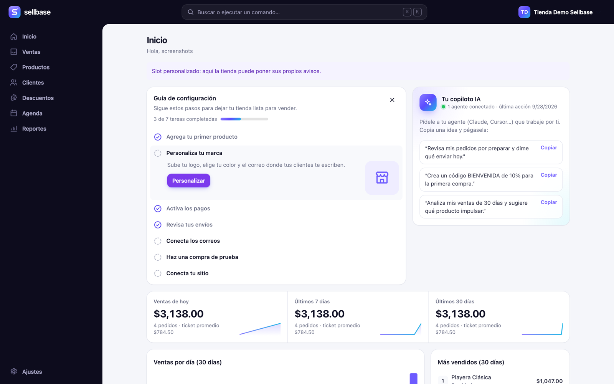
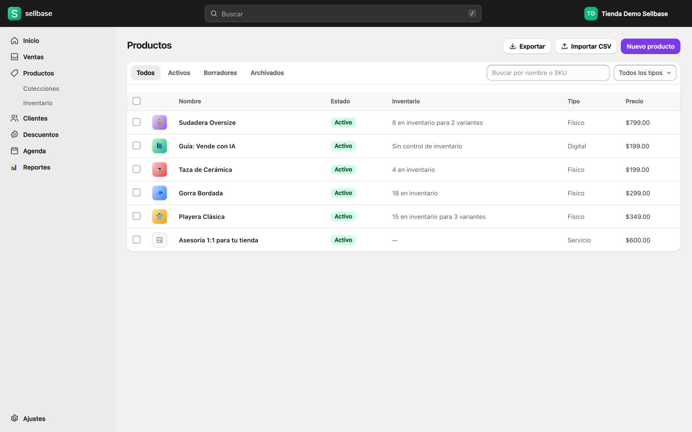
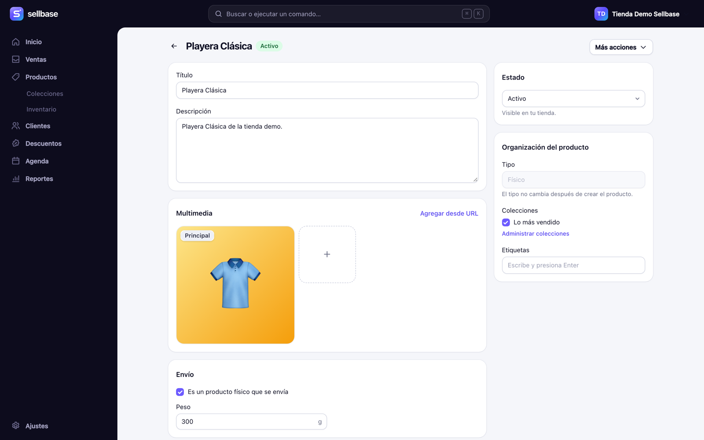
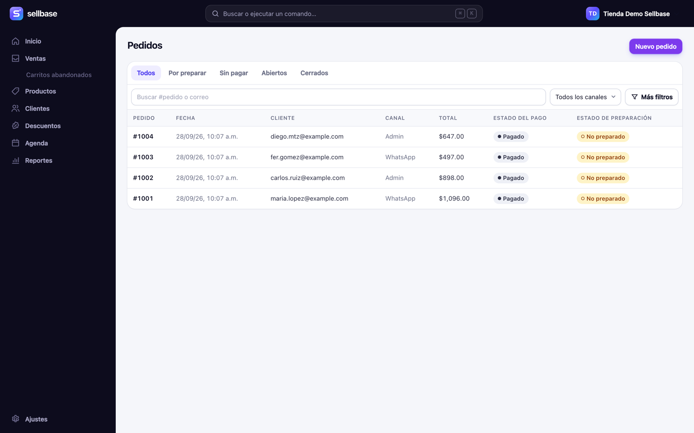
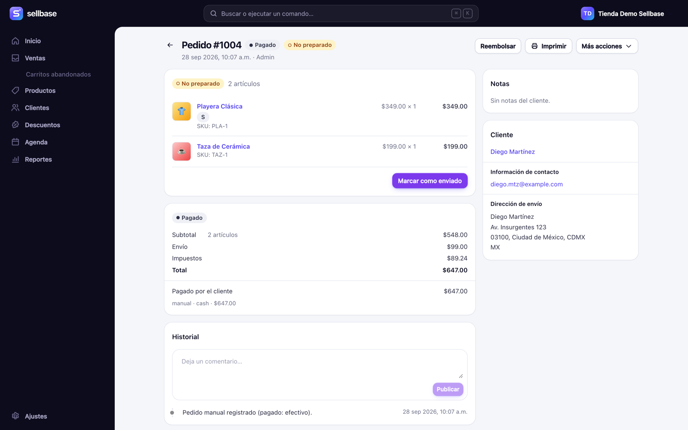
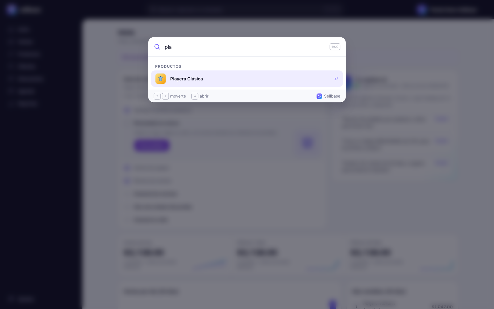
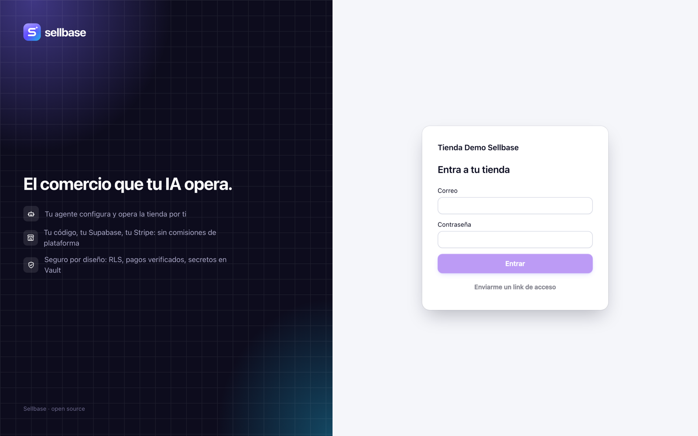
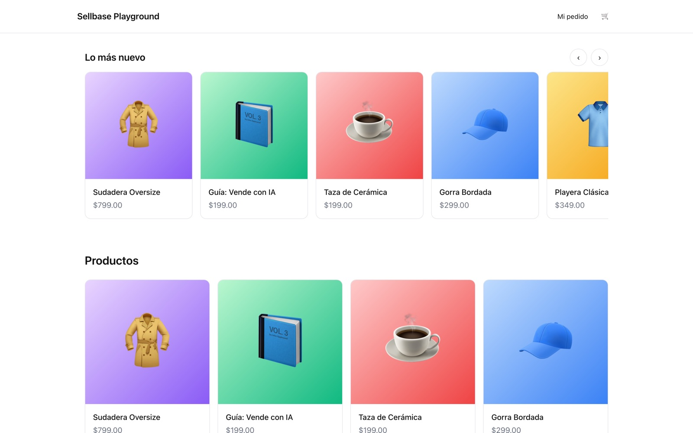

<div align="center">


# Sellbase

**Open source commerce that lives inside your project, run by your AI agent.**

Catalog, checkout, orders, inventory, abandoned carts, discounts, appointments, emails, a complete admin, an API and an MCP server, all installed in **your repo** and **your Supabase** with one command.

[Quick start](#quick-start) · [Features](#features) · [Docs](#documentation) · [Deploy](docs/guides/deploy.md) · [Contributing](CONTRIBUTING.md) · [Español](#en-español)



</div>

## Why Sellbase

- **Yours, end to end.** Your data lives in your Postgres, your money goes to your Stripe account and your code stays in your repo. There is no platform fee, no lock-in and no Sellbase servers in between. MIT licensed.
- **AI-first.** `sellbase init` writes `CLAUDE.md`/`AGENTS.md`, skills and an MCP server. Tell your agent "set up my store" and it creates products, connects payments and runs a test purchase. Money and destructive actions always ask the owner first, and everything is logged.
- **Works on any site.**
  - **Next.js and Vite + React:** React components.
  - **Plain HTML, WordPress, Webflow, Vue, Svelte, Astro, Angular:** `<sellbase-*>` web components (13 KB gzipped) and a static admin.
- **An admin that is a pleasure to use.** Products with drag and drop photos and variants, inventory, orders with packing slips and refunds, abandoned cart recovery, customers, discounts and settings for every connection. Also:
  - a command palette (⌘K) to search and act;
  - an AI copilot on Home;
  - built for store owners, not developers.
- **Safe by default.**
  - Money stored as integers.
  - RLS on every table, with tests.
  - Orders only come from verified payment webhooks.
  - Idempotent writes.
  - Third-party secrets in Supabase Vault.
  - Signed outbound webhooks that never reach private networks.

## Quick start

Requirements: Node 20+ and a Supabase project (or the local stack with Docker).

```bash
npx supabase start          # local stack (or pass --supabase-url … for a hosted project)
npx sellbase init --yes     # schema, Edge Functions, store, owner, admin, components, agent files
```

Then:

- **Admin:** open `/admin` and sign in. Locally, the owner's email and password are in `.env.sellbase`.
- **Setup:** follow the setup guide on Home.
- **Or let your agent do it:** open it in the project and say **"Configura mi tienda con Sellbase"** / **"Set up my store with Sellbase"**. It uses the `sellbase` MCP tools until a test purchase succeeds.

```bash
npx sellbase doctor         # checklist with the next step for anything missing
npx sellbase upgrade        # new versions: dry run, backup, migrations, functions, components
```

### With Claude Code

```
/plugin marketplace add jlgavel011/sellbase
/plugin install sellbase@sellbase
/sellbase:setup I sell handmade candles, $250 MXN each, shipping $120
```

The plugin brings the Sellbase skills and MCP server to every project. `/sellbase:setup` installs Sellbase, creates your products, connects Stripe in test mode and runs a test purchase. Any other MCP client can use `npx sellbase mcp` (listed in the MCP registry as `io.github.jlgavel011/sellbase`).

Going live: [deploy guide](docs/guides/deploy.md) and [live payments with Stripe](docs/guides/stripe-live.md).

## Features

|                                                           |                                                         |
| --------------------------------------------------------- | ------------------------------------------------------- |
|                |  |
|                    |                    |
|  |                  |

**Catalog:**

- physical products, digital downloads and services with appointments;
- up to 3 options per product (size, color…) with a variant matrix, compare-at prices and SEO;
- collections, tags and stock per variant;
- CSV import (including Shopify exports) and export;
- bulk price changes with a preview.

**Checkout:**

- Stripe Checkout (cards, Apple Pay, Google Pay; test and live mode);
- shipping rates, free shipping thresholds and local pickup;
- inclusive or exclusive taxes;
- discount codes and automatic discounts;
- deposits for services;
- a required consent checkbox (e.g. 18+ for alcohol) enforced by the server and stored with the order.

**Orders:**

- payment and fulfillment statuses;
- shipping with carrier and tracking;
- full or partial refunds;
- cancellations with restock;
- a timeline with comments;
- printable packing slips;
- manual orders (cash, transfer, WhatsApp) and payment links.

**Growth:**

- abandoned checkouts with one-click or automatic recovery emails that restore the cart;
- customers with their history;
- sales metrics and best sellers.

**Services:**

- resources with weekly hours and exceptions;
- availability;
- bookings with reminders (24 h and 2 h before) and calendar invites.

**Emails (Resend):** order confirmation with download links, shipping updates, refunds, cancellations, appointment notices and cart recovery. All of them carry your logo and brand color.

**Team and AI:**

- staff roles and invitations;
- API tokens with scopes for agents (money and data export scopes are opt-in);
- an activity log;
- signed outbound webhooks with retries for your ERP, spreadsheets or Zapier.

**Storefront:**

- React components copied into your repo (edit freely);
- headless hooks;
- web components for any site;
- SEO helpers (JSON-LD, sitemap);
- order lookup and download pages;
- accessible markup (checked with axe).



## How it works

```
your site ──(@sellbase/react or <sellbase-*> web components)──┐
/admin (@sellbase/admin) ─────────────────────────────────────┤
your AI agent ──(sellbase MCP server)─────────────────────────┤
                                                              ▼
                    Supabase: Edge Functions (sellbase-api, -webhooks, -jobs)
                              Postgres schema `sellbase` (RLS) · Vault · Storage · pg_cron
                                                              │
                                   Stripe · Resend · your webhooks
```

- **One API contract.** Every route is declared once with Zod in `@sellbase/core`. The Hono server validates with it, the OpenAPI spec and the typed SDK come from it, and the MCP tools reuse it.
- **Snapshots.** Orders keep a copy of prices, titles and addresses, so later catalog changes never alter past orders.
- **The outbox.** Business events are written in the same transaction as the change; jobs deliver emails and webhooks from it.

| Package                             | What it is                                                      |
| ----------------------------------- | --------------------------------------------------------------- |
| [`sellbase`](packages/cli)          | CLI: `init`, `doctor`, `upgrade`, `add`, `seed`, `token`, `mcp` |
| [`@sellbase/admin`](packages/admin) | The admin (React), also shipped as a static page                |
| [`@sellbase/react`](packages/react) | Provider and hooks for storefronts                              |
| [`@sellbase/web`](packages/web)     | Web components for any site                                     |
| [`@sellbase/sdk`](packages/sdk)     | Typed API client and SEO helpers                                |
| [`@sellbase/mcp`](packages/mcp)     | MCP server for AI agents                                        |
| [`@sellbase/core`](packages/core)   | Schemas, API contracts, pricing, state machines                 |

## Documentation

- [Getting started (español)](docs/guides/getting-started.md)
- [Deploy to production](docs/guides/deploy.md)
- [Customize the admin](docs/guides/customize-admin.md)
- [Live payments with Stripe (español)](docs/guides/stripe-live.md)
- [API reference](docs/reference/api.md), plus [`llms.txt`](docs/llms.txt) and [`llms-full.txt`](docs/llms-full.txt) for agents
- [Specification](SPEC.md) and [architecture decisions](docs/decisions/)
- [Changelog](CHANGELOG.md)

## Development

```bash
pnpm i
pnpm exec supabase start && node scripts/seed-demo.mjs
pnpm dev                    # playground on http://localhost:3100 (admin at /admin)
pnpm lint && pnpm typecheck && pnpm test
pnpm test:db                # pgTAP
pnpm test:integration       # API against the local database
pnpm test:e2e               # Playwright
node scripts/acceptance.mjs # clean project → init → agent over MCP → test purchase
```

See [CONTRIBUTING.md](CONTRIBUTING.md). Security issues: [SECURITY.md](SECURITY.md).

## Status

Sellbase is **0.3**, young but complete. The full flow is covered by CI on every commit:

- pgTAP;
- API integration;
- Playwright end to end;
- a clean-install acceptance test with a real agent over MCP.

Next on the roadmap:

- an installation guide per hosting provider;
- more payment providers (Mercado Pago, OXXO via Stripe);
- shipping label integrations;
- invoicing (CFDI).

## En español

Sellbase es un kit de comercio open source que se instala **dentro de tu proyecto** (tu repo y tu Supabase) y que tu agente de IA puede configurar y operar.

**Qué incluye:**

- catálogo con fotos y variantes;
- checkout con Stripe;
- pedidos, inventario y carritos abandonados;
- descuentos, citas y correos;
- un admin completo en `/admin`;
- una API y un servidor MCP.

Funciona en Next.js, Vite + React y en cualquier sitio (HTML puro, WordPress, Webflow…) con componentes web.

```bash
npx supabase start
npx sellbase init --yes
```

Después entra a `/admin` (en local, el usuario y la contraseña quedan en `.env.sellbase`) o dile a tu agente: **"Configura mi tienda con Sellbase"**.

Guías: [primeros pasos](docs/guides/getting-started.md), [cobrar de verdad con Stripe](docs/guides/stripe-live.md) y [despliegue](docs/guides/deploy.md).

## License

[MIT](LICENSE)
